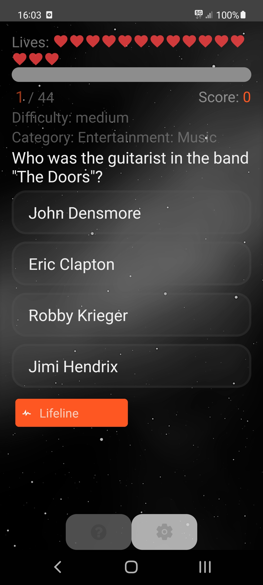

# ImpossibleQuiz

<p align="left">
  <a href="https://reactnative.dev/" target="blank"></a>
  <a href="https://www.javascript.com/" target="blank"></a>
  <a href="https://www.typescriptlang.org/" target="blank"></a>
</p>

# <p align="left">[](./repo-assets/header.png)</p>
- Over 4000 Trivia Questions
## Installation

```
npm install
```

## Running the app

- start the metro bundler
```
npm start
```
- build and run the app on android
```
npm run android
```
- or ios
```
npm run ios
```

## Test

```bash
npm run test
```

## Preview
## <p align="left">[](./repo-assets/preview.jpg)</p>

## Inspired by
https://github.com/RushikeshVidhate/react-native-quiz-app